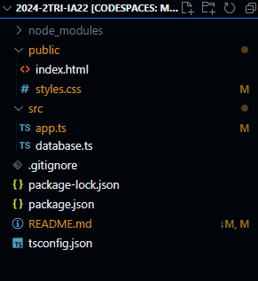

# Inicialização
<sub> **Exclarecimento:** Esse tutorial foi escrito por um jovem formando do ensino médio, muitas piadas não vão caí fácil, outras de mau gosto, peço minhas _não muitas_ sinceras desculpas pelo o que for ler ❤︎</sub>

Abra seu `Visual Studio Code` no seu computador, você tanto web ou nativamente, crie uma pasta de qualquer nome dentro do Visual Code e abrindo o terminal com `Ctrl + "` inicialize as seguintes instruções:

```bash
npm init -y
npm install express cors sqlite3 sqlite
npm install --save-dev typescript nodemon ts-node @types/express @types/cors
npx tsc --init
```

Pode colar tudo de uma vez que será executado individualmente cada instrução.

Baixes esse arquivo compactado aonde terá nossa aplicação, *uai isso não erá para ser um tutorial que me ensinaria a como fazer uma aplicação?* Não, o Vrau-nelas /aka/ @drachehavoc, somente vai nos avaliar se você, novato, conseguir rodar essa aplicação, não se entendeu, sinta dor por saber que você poderia muito cabular essa aula.

[baixar código](https://tinyurl.com/mr24psbh)

Depois iremos usar essas pastas, aproveita de deixe descompilada, não se preocupe, porque ninguém precisa saber que você não sabe como descompactar uma pasta, segue ai o tutorial:


(já deixei descompactado para você, mesmo assim vou deixar o varela ai  ❤︎)

## Configurando
Mas antes de escrever algo, precisamos configurar nosso projeto para atender as necessidades da nossa aplicação, iremos alterar 3 itens, o arquivo nomeado `package.json`, `tsconfig.json` e o *`.gitignore` (que iremos inicializar se você for colocar no seu Git, se não é opcional).

Dentro do `package.json` será as nossas dependências para o nosso projeto, localize o trecho escrito `"scripts":` e coloque entre as chaves ( "{" e "}") e antes de qualquer coisa que já está escrito ali, esse trecho:

```json 
 "dev": "nodemon src/app.ts",
```

Certifique-se que cada "instrução" esteja separada por vírgulas (exceto a última instrução), a sintaxe do .JSON requere isso, se não resultará em erros. Por isso é preciso que cole isso antes de qualquer coisa que esteja ali, mas se não tiver nada já escrito, *remova a vírgula.

Dentro do `tsconfig.json` será as configurações do nosso projeto, de primeira vai ter coisa para caralho comentada: 

```js
//algo assim
```

Pode sem medo apagar tudo e colar esse trecho abaixo (é mais fácil assim do que fazer você localizar aonde escrever nossas dependências ❤︎)

```ts
{
  "compilerOptions": {
    "target": "ES2017",
    "module": "commonjs",
    "outDir": "./dist",
    "rootDir": "./src",
    "strict": true,
    "esModuleInterop": true,
    "skipLibCheck": true,
    "forceConsistentCasingInFileNames": true
  }
}
```

**(Opcional)**
Crie um arquivo *dentro da sua pasta principal (aquela que você criou) o arquivo nomeado ``.gitignore``, e dentro desse arquivo coloque esse trecho:
```bash
node_modules/
dist/
database.sqlite/
```
Esse arquivo diz para quando for fazer o ``commit`` no git, para ignorar essas pastas, porque elas não são necessárias para guardar no seu repositório, e no terminal são facilmente re-instanciadas fazendo aquilo no começo do tutorial.

# "Codando"

Okay, naquelas pastas que você descompilou, coloque aqui no seu projeto a pasta nomeada `src`, dentro dela terá nossa aplicação, *certifique-a não esteja dentro de outra pasta ao não ser do seu projeto.
Nessa pasta `src` deverá ter um `app.ts`, e `database.ts`.

Okay, vamos rodar nosso projeto, abrindo nosso terminal digite `npm run dev` que será aberto no nosso local, a nossa aplicação, eu configurei para a nossa porta ser 3333, certifique-se que no terminal apareceu a porta correspondente.

## Atenção
Lembre-se que você está fazendo essa atividade no instituto, porque os técnicos de TI são uns cagão, colocaram muitas barragens para evitar à execução de nossas aplicações que puxam a rede (arregões que não "takam" um x*1* trojam e servidor do if), bem, para nosso belo caso, não precisamos a assistência do .Node pois nós estamos abrindo uma `hospedagem-local`, se aparecer um aviso pedindo permição para o `Node/Javascript runtime` ser executado clique em cancelar (já que é a única escolha).

Agora pode mudar um pouco, dependendo onde você esteja programando, se você estiver na web, aparecerá um botão na lateral inferior que te redimensionara até o :localhost, mas se estiver codando isso nativamente, abra seu navegador de preferência e digite essa url: `http://localhost:3333/`, ou clique enquanto pressiona `Ctrl` no link que aparecer no terminal que te redimensionar para uma aba no seu navegador padrão.

Se aparecer alguma coisa que eu coloquei porque me acho mega engraçadaso é porque funcionou :3

## Deu merda
Às vezes, por motivos que eu não me importo de explicar, a nossa porta já pode está sendo usada, então para nós usar outra porta, vá até o arquivo `app.ts`, que está localizado na pasta
`src`, e na **linha 5** mude a porta entre um valor entre 3000 - 3999, por que 3999? fds kkkk
Depois no terminal, clique nele e pressione `Ctrl + C` para parar nossa aplicação, depois salve suas alterações, clique na aba escrito `PORTAS` e feche a porta anterior:


E digite novamente `npm run dev` e confira se funcionou.

# Para acabar logo com tudo
okay, tudo funcionando anteriormente, coloque a segunda pasta do arquivo de descompactamos no seu projeto, *certifique-se que não esteja em nenhuma outra pasta:
Como deverá estar seu projeto por agora:



E depois, vá até a pasta `src` e no arquivo `app.ts` "des"-comente esse trecho:

Como está por agora
```ts
//descomente isso depois
//app.use(express.static(__dirname + '/../public'))

//comente isso depois
app.get('/', (req, res) => res.send(' > funfo :3'))
```

Para ficar assim

```ts
//descomente isso depois
app.use(express.static(__dirname + '/../public'))

//comente isso depois
//app.get('/', (req, res) => res.send(' > funfo :3'))
```

Abra seu terminal, clique nele e feche a aplicação pressionando `Ctrl + C`, salve suas alterações e escreva novamente `npm run dev`, certifique-se que a nossa porta de uso (3333).

Fim
----
Tutorial por: Marcus P. 
