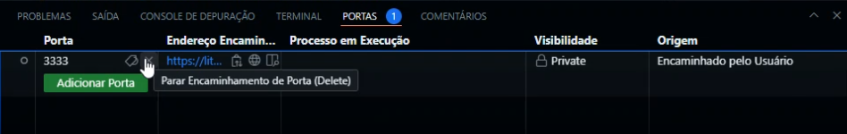
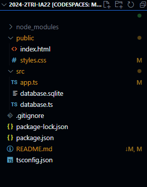

# Inicialização

Abra seu `Visual Studio Code` no seu computador, você tanto web ou nativamente, crie uma pasta de qualquer nome dentro do Visual Code e abrindo o terminal com `Ctrl + "` inicialize as seguintes intruções:

```bash
npm init -y
npm install express cors sqlite3 sqlite
npm install --save-dev typescript nodemon 
ts-node @types/express @types/cors
npx tsc --init
```

Pode colar tudo de uma vez que será executado individualmente cada instrução.

Baixes esse arquivo compactado aonde terá nossa aplicação, *uai isso não erá para ser um toturia que me insinaria a como fazer uma aplicação?* Não, o Vrau-nelas /aka/ @drachehavoc, somente vai nos avaliar se você, novato, conseguir rodar essa aplicação, não se entendeu, sinta dor por saber que você poderia muito cabular essa aula.

dasdkadkasodkaosdp

Depois iremos usar essas pastas, aproveita de deixe descompilada, não se preocupe, porquê ninguém precisa saber que você não sabe como descompactar uma pasta, segue ai o toturial:


## Configurando
Mas antes de escrever algo, precisamos configurar nosso projeto para atender as necessidades da nossa aplicação, iremos alterar 3 itens, o arquivo nomeado `package.json`, `tsconfig.json` e o *`.gitignore` (que iremos inicializar se você for colocar no seu Git, se não é opcional).

Dentro do `package.json` será as nossas depedências para o nosso projeto, localize o trecho escrito `"scripts":` e coloque entre as chaves ( "{" e "}") e antes de qualquer coisa que já está escrito alí, esse trecho:

```json
 "dev": "nodemon src/app.ts",
```

Certifique-se que cada "instrução" esteja separada por vírgulas (exceto o última instrução), a sintaxe do .JSON requere isso, se não resultará em erros. Por isso é precio que cole isso antes de qualquer coisa que esteja alí, mas se não tiver nada já escrito, *remova a vírgula.

Dentro do `tsconfig.json` será as configurações do nosso projeto, de primeira vai ter coisa para caralho comentada: 

```js
//algo assim
```

Pode sem medo apagar tudo e colar esse trecho abaixo (é mais fácil assim doque fazer você localizar aonde escrever nossas dipedencias ❤︎)

```ts
{
  "compilerOptions": {
    "target": "ES2017",
    "module": "commonjs",
    "outDir": "./dist",
    "rootDir": "./src",
    "strict": true,
    "esModuleInterop": true,
    "skipLibCheck": true,
    "forceConsistentCasingInFileNames": true
  }
}
```

**(Opicional)**
Crie um arquivo *dentro da sua pasta principal (aquela que você criou) o arquivo nomeado ``.gitignore``, e dentro desse arquivo coloque esse trecho:
```bash
node_modules/
dist/
database.sqlite/
```
Esse arquivo diz para quando for fazer o ``commit`` no git, para ignorar essas pastas, porque elas não são necessárias para guardar no seu repostório, e no terminal são fácilmente re-instanciadas fazendo aquilo no começo do toturial.

# "Codando"

okay, naquelas pastas que você descompilou, coloque aqui no seu projeto a pasta nomeada `src`, dentro dela terá nossa aplicação, *certifiquece que ela não esteja dentro de outra pasta ao não ser do seu projeto.
Nessa pasta `src` deverá ter um `app.ts`, e `database.ts`.

Okay, vamos rodar nosso projeto, abrindo nosso terminal digite `npm run dev` que será aberto no nosso local a nossa aplicação, eu configurei para a nossa porta ser 3333, certifique-se que no terminal apareceu a porta correspondente.
Agora pode mudar um pouco, depedendo aonde você esteja programando, se você estiver na web, aparecerá um botão na lateral inferior que te redimericionará até o :localhost, mas se estiver codando isso nativamente, abra seu navegador de preferência e digite essa url: `http://localhost:3333/`.

Se aparecer alguma coisa que eu coloquei porque me acho mega engraçadaço é porquê fucionou :3

## Deu merda
As vezes, por motivos que eu não me importo de explicar, a nossa porta já pode está sendo usada, então para nós usar outra porta, vá até o arquivo `app.ts`, que está localizado na pasta
`src`, e na **linha 5** mude a porta entre um valor entre 3000 - 3999, porque 3999? fds kkkk
Depois no terminal, clique nele e precione `Ctrl + C` para parar nossa aplicação, depois salve suas alterações, clique na aba escrito `PORTAS` e feche a porta anterior:



E digite novamente `npm run dev` e confirá se funcionou.

# Para acabar logo com tudo
okay, tudo funcionando anteriomente, coloque a segunda pasta do arquivo de descompactamos no seu projeto, *certifique-se que não esteja em nenhuma outra pasta:
Como deverá está seu projeto por agora:



E depois, vá até a pasta `src` e no arquivo `app.ts` descomente esse trecho:

Como está por agora
```ts
//descomente isso depois
//app.use(express.static(__dirname + '/../public'))

//comente isso depois
app.get('/', (req, res) => res.send(' > funfo :3'))
```

Para ficar assim

```ts
//descomente isso depois
app.use(express.static(__dirname + '/../public'))

//comente isso depois
//app.get('/', (req, res) => res.send(' > funfo :3'))
```

Abra seu terminal, clique nele e feche a aplicação precionando `Ctrl + C`, salve suas alterações e escreva novamente `npm run dev`, certifique-se que a nossa porta de uso (3333) apareceu e cole o memso url no seu navegador de preferencia: `http://localhost:3333/`

Fim
----
Toturial por: Marcus P. 